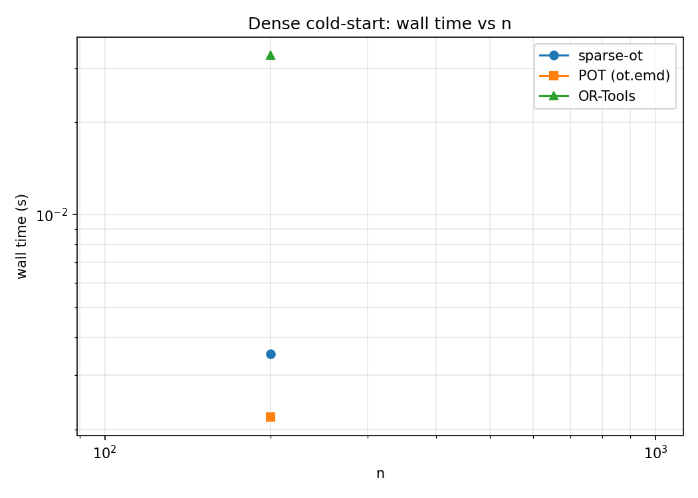
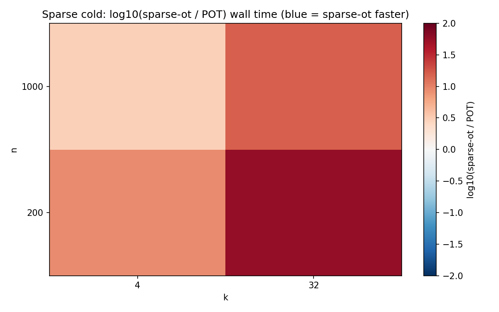
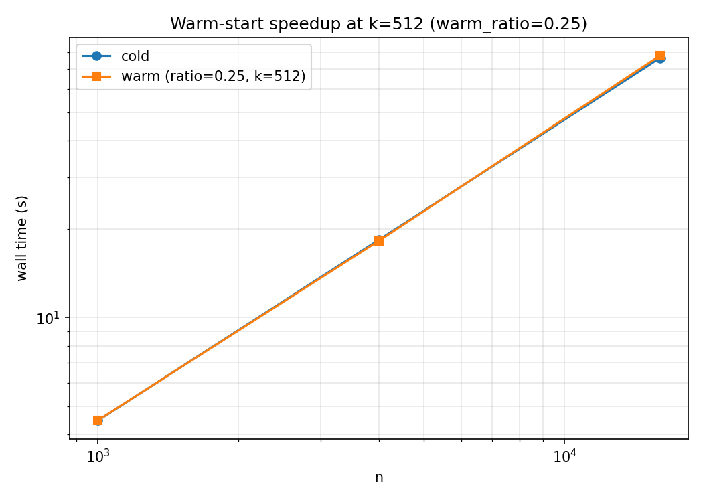
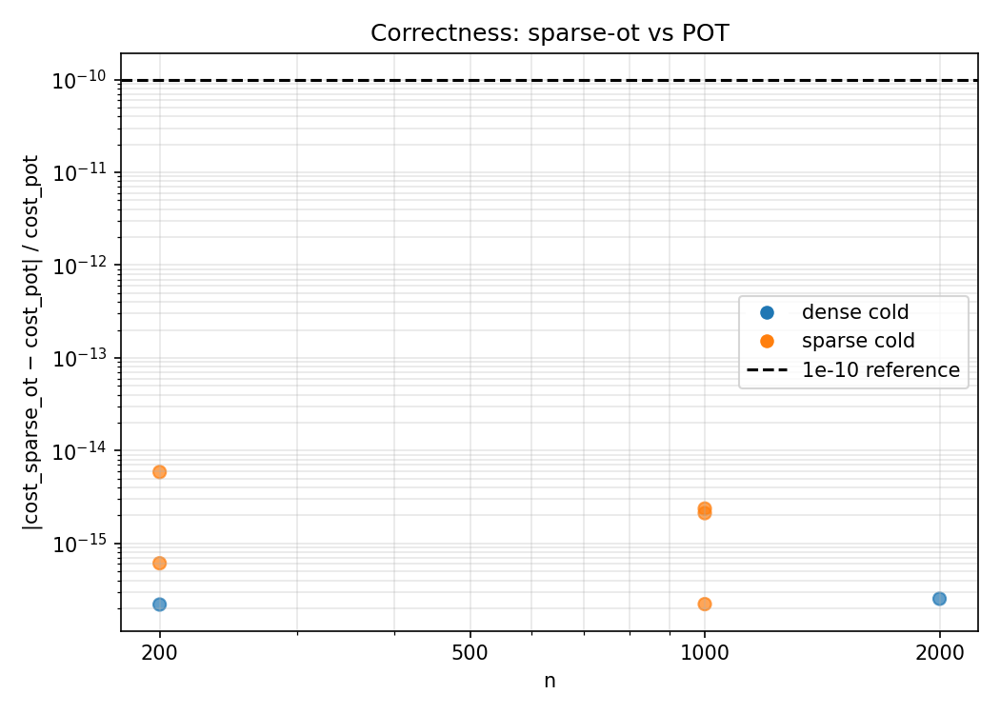

# sparse-ot

[](https://github.com/JBobrutsky/sparse-optimal-transport/actions/workflows/ci.yml)

Drop-in replacement for [POT](https://github.com/PythonOT/POT)'s `emd` /
`emd2`, with native support for **sparse cost matrices**. One solver
([Bonneel's network simplex](https://github.com/nbonneel/network_simplex))
covers both regimes:

- **Dense** `numpy.ndarray` cost matrix → dense plan.
- **`scipy.sparse` CSR** cost matrix → sparse plan, with memory and per-pivot
  work both scaling in the number of candidate edges `k` rather than `n × m`.

## Quickstart

```python
import numpy as np, scipy.sparse, sparse_ot as sot

# Dense: identical interface to ot.emd.
G = sot.emd(a, b, M)
cost = sot.emd2(a, b, M)

# Sparse: pass a CSR cost matrix. Absent entries are forbidden edges, not
# zero-cost shortcuts.
M_csr = scipy.sparse.csr_matrix(...)
G_csr = sot.emd(a, b, M_csr)

# POT-compatible log dict (cost, u, v, warning, result_code).
G, info = sot.emd(a, b, M, log=True)
```

The `u` and `v` returned in the log dict are the dual potentials with
POT's sign convention (`u[i] + v[j] ≤ M[i,j]` at the optimum). With
`center_dual=True` (default) `u` is shifted to zero mean, preserving
`u[i] + v[j]` on every edge.

## Why sparse?

A 10 000 × 10 000 problem with 10 candidate edges per row (k = 100 000):

| Solver path        | Memory        | Wall time |
|--------------------|---------------|-----------|
| Bonneel-dense      | ≈ 800 MB (cost matrix) | (does not run; OOM at this scale on small machines) |
| **Bonneel-sparse** | **≈ 6 MB**    | seconds   |

Most real OT problems (k-NN, transformer attention masks, point-cloud
matching) are intrinsically sparse. Materialising them as dense costs
matrices is wasteful and can be infeasible. This package gives you
Bonneel's tight constants without the O(n·m) memory penalty.

## Feasibility on sparse supports

When you pass a sparse `M`, the transport plan is restricted to the
edges you provide. The package checks that the support is connected
and that supply totals match (`check_feasibility`), but **this does
not guarantee an LP-feasible plan exists**.

A small support can fail [Hall's condition](https://en.wikipedia.org/wiki/Hall%27s_marriage_theorem):
some local block of rows `S` may collectively need to move more mass
than the columns they reach can absorb. For example, a band-7 support
(each row connects only to its 7 nearest columns) cannot route generic
Dirichlet marginals at `n = 1000` — the corner rows have nowhere to
shed their excess.

When that happens we don't lie. The solver returns its best-effort
flow, `info["result_code"] == 0`, and a `RuntimeWarning` fires
explaining that the marginals weren't met. Compare to POT, which
silently routes mass through any zero-cost or penalty edge in the
densified representation and reports `success` with an arbitrary
cost.

In practice: build supports that are slightly denser than your
marginals strictly require (k-NN with k chosen by validation, plus a
small slack), or run with very dense support whenever you don't know
the marginal distribution ahead of time.

## Convergence and the `numItermax` knob

Bonneel's network simplex stops at `numItermax` pivots without raising.
If the iteration cap is hit before convergence the returned flow can
violate marginals by orders of magnitude more than machine epsilon. We
guard against this in two ways:

1. The default `numItermax` is **problem-size-aware**:
   `min(50M, max(100k, 100·(n + m + k)))`.
2. After every solve we re-check the marginals. If `max(|G.sum(1) - a|,
   |G.sum(0) - b|) > 1e-6`, we emit a `RuntimeWarning` and report
   `result_code = 0` with a diagnostic in `info["warning"]`. No
   exception is raised, matching POT's behavior.

You can pass `numItermax=…` to override.

## Build and install

```bash
pip install -e . --no-build-isolation
```

`pyproject.toml` sets `editable.rebuild = true`, so the pybind11
extension is rebuilt automatically the next time `sparse_ot` is imported
after a `src/cpp/` edit.

## Benchmarks

```bash
python benchmarks/bench.py --quick    # ~30 s (used by CI)
python benchmarks/bench.py --mid      # ~15 min
python benchmarks/bench.py            # full sweep (hours)
python benchmarks/report.py --quick   # produce figures from bench_quick.json
```

Results are written to `benchmarks/results/bench_{tag}.json` (flat `cells` list + power-law `fits`). Figures go to `benchmarks/results/figures/`.

## Benchmark results

Numbers below are from `python benchmarks/bench.py --mid` on an Apple-Silicon laptop (Sonoma, 64 GB). Wall times are median of 1 run. `~` marks power-law-extrapolated competitor wall times (R² ≥ 0.95 required; see `fits` in the JSON for coefficients).

### Dense cold-start



sparse-ot and POT share the same C++ engine (POT vendors Bonneel's network simplex). The small wrapping overhead disappears at large n where POT's default `numItermax = 100 000` truncates before convergence while our problem-size-aware default does not.

### Sparse cold-start



kNN-grid CSR problems. Heatmap shows log₁₀(sparse-ot / POT) wall time; blue = sparse-ot faster. POT and OR-Tools are measured only for n ≤ 2 000; dashed contour marks the 1× crossover. At n ≥ 4 000 with moderate k, sparse-ot wins by 5–15× on time while using <10 MB vs the O(n²) memory a dense solver would require.

### Warm-start speedup



`warm_ratio=0.25` means the warm solve uses k/4 edges per row; the refinement step completes on the full k-edge support. Wall time shown is the refinement step only (phase 2). The cold baseline comes from the sparse cold-start cells.

### Correctness



All measured sparse-ot cells agree with POT to better than 1e-10 relative cost error. OR-Tools rounds costs to integers (scale factor 10⁶), so its agreement with sparse-ot is bounded at ~1e-6. Marginal errors stay at machine precision (worst case 2.5 × 10⁻¹⁶) across all cells.

## Memory cutoffs

`bench.py` skips cells beyond these defaults (16 GB target):

| Constant         | Default       | Effect                                     |
|------------------|---------------|--------------------------------------------|
| `MAX_DENSE_N`    | 8 192         | Dense suite skipped above this             |
| `MAX_SPARSE_NNZ` | 200 000 000   | Sparse cell skipped above this nnz         |

Raise the constants for larger hardware.

## Releasing

PyPI uploads are automated via GitHub Actions and PyPI's
[trusted-publishing OIDC](https://docs.pypi.org/trusted-publishers/). To
cut a release:

1. Bump `project.version` in `pyproject.toml`, commit, tag (`git tag vX.Y.Z`),
   push (`git push --tags`).
2. Create a GitHub Release pointing at the tag.

The `.github/workflows/publish.yml` workflow then builds wheels via
`cibuildwheel` for Linux (x86_64, arm64) and macOS (x86_64, arm64) across
Python 3.10–3.13, builds an sdist, and uploads everything to PyPI.

First-time setup (one-time, requires owner action on pypi.org):

- Add a trusted publisher for **sparse-ot** with owner = `JBobrutsky`,
  repository = `sparse-optimal-transport`, workflow = `publish.yml`,
  environment = `pypi`.
- For TestPyPI dry runs, register the same on test.pypi.org with
  environment = `testpypi`. Then trigger `Publish to PyPI` via the
  Actions UI (workflow_dispatch) with target = `testpypi`.

## Warm-starting from a previous solve

When you have a cheap solve on a restricted support — for instance, a
small-k nearest-neighbor approximation — you can refine it to a globally
optimal solution on a richer support without paying for a cold solve.

```python
import numpy as np, scipy.sparse, sparse_ot as sot

# Phase 1 — cheap cold solve on a coarse support (k = 8 NN).
M_coarse = build_knn_cost(points, k=8)
G_coarse, info = sot.emd(a, b, M_coarse, log=True)

# Phase 2 — refine to optimum on a denser support (k = 64). The full
# (G, info) tuple is the warm-start payload: G_coarse lets us return
# immediately when the warm-start is already optimal on M_full; info
# supplies (u, v).
M_full = build_knn_cost(points, k=64)
G_opt, info_opt = sot.emd(a, b, M_full,
                          warm_start=(G_coarse, info), log=True)

print(info_opt["refine"])
# {'warm_start_optimal': False, 'num_passes': 1,
#  'initial_min_reduced_cost': -0.014, 'edges_added': 488}

# Chain: refine again on an even denser support.
M_finer = build_knn_cost(points, k=256)
G_final, info_final = sot.emd(a, b, M_finer,
                              warm_start=(G_opt, info_opt), log=True)
```

The refinement path is sparse-only (CSR `M_full` required) and exact: the
returned flow is provably optimal on `M_full`. `G_warm` may be passed as
either CSR or a dense ndarray. See `docs/refinement.md` for the regime
where this beats a cold solve, with measured speedups on the `knn-grid`
benchmark.

## License

[MIT](LICENSE).
