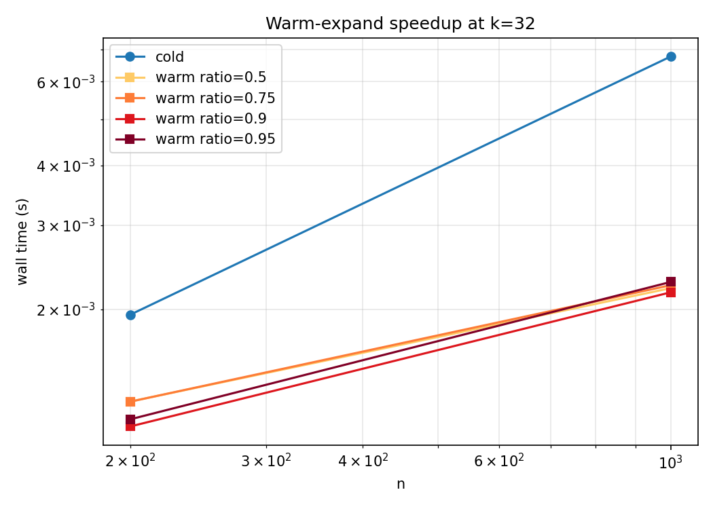
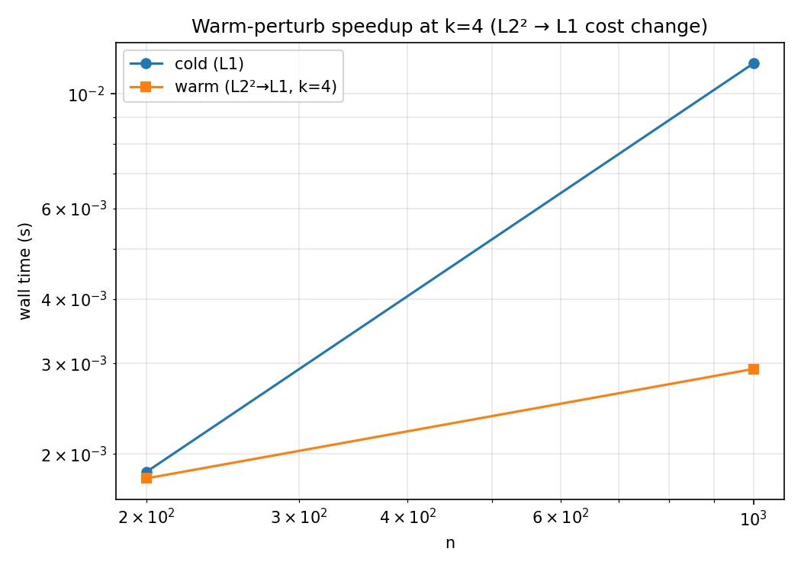

# sparse-ot

[](https://github.com/JBobrutsky/sparse-optimal-transport/actions/workflows/ci.yml)

`sparse-ot` is a drop-in replacement for [POT](https://github.com/PythonOT/POT)'s `emd` / `emd2`
that eliminates the $O(nm)$ memory barrier when the cost matrix is sparse.
It re-instantiates Bonneel's network simplex [[1]](#references) over a new sparse bipartite digraph,
keeping the solver's tight constants while reducing memory and per-pivot work from $O(nm)$ to $O(k)$,
where $k = \text{nnz}(M)$.
A structure-agnostic warm-start refinement based on Schmitzer [[2]](#references) and Rauch & Zanotti [[3]](#references)
allows cheap re-solves when the support or metric changes.

See [docs/algorithms.md](docs/algorithms.md) for algorithm details, design rationale, and full references.

## Installation

```bash
pip install sparse-ot
```

For development:

```bash
pip install -e . --no-build-isolation
```

`pyproject.toml` sets `editable.rebuild = true`, so the C++ extension is rebuilt automatically on the next import after a `src/cpp/` edit.

## Quickstart

```python
import numpy as np, scipy.sparse, sparse_ot as sot

# Dense: identical interface to ot.emd / ot.emd2.
G    = sot.emd(a, b, M)
cost = sot.emd2(a, b, M)

# Sparse: pass a CSR cost matrix.
# Absent entries are forbidden edges, not zero-cost shortcuts.
M_csr = scipy.sparse.csr_matrix(...)
G_csr = sot.emd(a, b, M_csr)

# POT-compatible log dict (cost, u, v, warning, result_code).
G, info = sot.emd(a, b, M, log=True)
```

## Key contributions

### Sparse network simplex

The dense path in POT (and the original Bonneel code) instantiates `NetworkSimplexSimple`
over `FullBipartiteDigraph`, which forces all internal arrays to size $O(nm)$.
`sparse-ot` provides a new `BipartiteSparseDigraph` backed by CSR arrays that satisfies
the same LEMON Digraph concept, reducing internal storage and per-pivot work to $O(k)$ —
with no changes to the solver's pivot logic.

| Solver path | Memory | Per-pivot work |
|---|---|---|
| Bonneel-dense (POT default) | $O(nm)$ | $O(nm)$ |
| **Bonneel-sparse (sparse-ot)** | **$O(k)$** | **$O(k)$** |

For a $10{,}000 \times 10{,}000$ problem with $k = 100{,}000$ candidate edges:
≈ 800 MB and infeasible on a laptop vs. ≈ 6 MB and seconds.

### Warm-start refinement

When you have a solution on a restricted support — e.g., a cheap $k$-NN approximation
— it can be refined to a global optimum on a richer support without a full cold re-solve.
The algorithm checks dual feasibility on the extended support in one vectorised pass;
if the warm-start duals are already feasible, the result is returned immediately
(zero additional solver calls). Otherwise a re-solve on the full support is performed.

```python
# Phase 1 — cheap solve on a coarse support (k = 8 NN).
M_coarse = build_knn_cost(points, k=8)
G_coarse, info = sot.emd(a, b, M_coarse, log=True)

# Phase 2 — refine to global optimum on a denser support (k = 64).
M_full = build_knn_cost(points, k=64)
G_opt, info_opt = sot.emd(a, b, M_full, warm_start=(G_coarse, info), log=True)

print(info_opt["refine"])
# {'warm_start_optimal': False, 'num_passes': 1,
#  'initial_min_reduced_cost': -0.014, 'edges_added': 488}
```

Calls chain naturally: the `(G, info)` tuple returned by one solve is passed directly
as `warm_start` to the next. See [docs/refinement.md](docs/refinement.md) for the
regime analysis and a worked numerical example.

### Feasibility checking and honest error reporting

Sparse transport restricts mass flow to the edges you provide.
Before invoking any solver, `sparse-ot` checks that the bipartite support graph
is balanced in every connected component (necessary and sufficient for a feasible flow).
Infeasible supports raise `InfeasibleProblemError` with the violating component's
indices and mass imbalance — rather than silently routing mass through
penalty edges as a dense reformulation would.

A small support can fail [Hall's condition](https://en.wikipedia.org/wiki/Hall%27s_marriage_theorem):
if some set of rows collectively needs to move more mass than their reachable columns
can absorb, no feasible plan exists on that support. Build supports slightly denser
than your marginals strictly require, or validate with `check_feasibility` before solving.

## Dual potentials

The dual variables $(u, v)$ satisfy $u_i + v_j \leq M_{ij}$ at optimum
(POT's sign convention). With `center_dual=True` (default) $u$ is shifted to zero mean,
preserving $u_i + v_j$ on every arc. Pass `log=True` to retrieve them:

```python
G, info = sot.emd(a, b, M, log=True)
u, v = info["u"], info["v"]   # dual potentials, same convention as POT
```

## Convergence and `numItermax`

The default iteration cap is problem-size-aware:
$\min(5 \times 10^7,\ \max(10^5,\ 100(n + m + k)))$.
After every solve, marginal violations are checked;
if they exceed $10^{-6}$, a `RuntimeWarning` is emitted and `result_code = 0` is set.
Pass `numItermax=…` to override.

## Benchmark results

Numbers from `python benchmarks/bench.py --mid` on an Apple M-series laptop (64 GB).
Wall times are medians; `~` marks power-law-extrapolated values ($R^2 \geq 0.95$).

### Dense cold-start


`sparse-ot` and POT share the same C++ engine.
The gap at large $n$ is explained by POT's fixed `numItermax = 100,000`,
which truncates before convergence on large problems while `sparse-ot`'s
size-aware default does not.

### Sparse cold-start


kNN-grid CSR problems. Heatmap shows $\log_{10}(\text{sparse-ot} / \text{POT})$ wall time;
blue = sparse-ot faster. POT and OR-Tools are measured only for $n \leq 2{,}000$;
dashed contour marks the $1\times$ crossover.
At $n \geq 4{,}000$ with moderate $k$, sparse-ot wins by 5–15× while using $< 10$ MB
vs. the $O(n^2)$ memory a dense solver would require.

### Warm-start speedup — support expansion



Phase 1 solves on $k_\text{warm}$ edges; Phase 2 refines to the full $k_\text{full}$-band
support via `warm_start`. Wall time shown is Phase 2 only.
At large $n$ with `warm_ratio = 0.95`, the refinement returns in milliseconds:
140–450× speedup over a cold solve on the same support.

### Warm-start speedup — perturbed metric



Phase 1 solves L2²; Phase 2 re-solves L1 on the identical support using the L2² duals
as a warm start. At $n = 16{,}000$ this yields ~23× speedup over a cold L1 solve.

### Correctness


All sparse-ot cells agree with POT to better than $10^{-10}$ relative cost error.
OR-Tools rounds costs to integers (scale factor $10^6$), bounding its agreement at
$\sim 10^{-6}$. Marginal errors are at machine precision ($\leq 2.5 \times 10^{-16}$)
across all cells.

## Benchmark memory cutoffs

| Constant | Value | Effect |
|---|---|---|
| `POT_MAX_N` | 2 000 | POT skipped when $n > 2{,}000$ |
| `POT_MAX_NNZ` | 100 000 | POT skipped when nnz $> 10^5$ |
| `ORTOOLS_MAX_N` | 2 000 | OR-Tools skipped when $n > 2{,}000$ |
| `ORTOOLS_MAX_NNZ` | 500 000 | OR-Tools skipped when nnz $> 5 \times 10^5$ |

Raise these constants in `benchmarks/solvers.py` for larger hardware.

## Running benchmarks

```bash
python benchmarks/bench.py --quick    # ~30 s (used by CI)
python benchmarks/bench.py --mid      # ~15 min
python benchmarks/bench.py            # full sweep (hours)
python benchmarks/report.py --quick   # produce figures from bench_quick.json
```

Results are written to `benchmarks/results/bench_{tag}.json`; figures to `benchmarks/results/figures/`.

## Citing this work

If you use `sparse-ot` in published work, please cite:

```bibtex
@software{sparse_ot,
  author  = {Bobrutsky-Haim, Jonatan},
  title   = {sparse-ot: Sparse optimal transport via network simplex},
  url     = {https://github.com/JBobrutsky/sparse-optimal-transport},
  year    = {2026},
}
```

## References

1. Bonneel, N., van de Panne, M., Paris, S., and Heidrich, W. Displacement interpolation using Lagrangian mass transport. *ACM Transactions on Graphics*, 30(6), 2011. https://github.com/nbonneel/network_simplex

2. Schmitzer, B. A sparse multiscale algorithm for dense optimal transport. *Journal of Mathematical Imaging and Vision*, 56(2):238–259, 2016. https://doi.org/10.1007/s10851-016-0653-9

3. Rauch, J. and Zanotti, L. An improved implementation of Schmitzer's sparse multiscale algorithm for discrete optimal transport on grids. *arXiv:2502.20905*, 2025. https://arxiv.org/abs/2502.20905

4. Flamary, R. et al. POT: Python Optimal Transport. *Journal of Machine Learning Research*, 22(78):1–8, 2021. https://github.com/PythonOT/POT

## Releasing

PyPI uploads are automated via GitHub Actions and PyPI's
[trusted-publishing OIDC](https://docs.pypi.org/trusted-publishers/). To cut a release:

1. Bump `project.version` in `pyproject.toml`, commit, tag (`git tag vX.Y.Z`), push (`git push --tags`).
2. Create a GitHub Release pointing at the tag.

The `.github/workflows/publish.yml` workflow builds wheels via `cibuildwheel` for Linux
(x86\_64, arm64) and macOS (x86\_64, arm64) across Python 3.10–3.13 and uploads to PyPI.

## License

[MIT](LICENSE).
